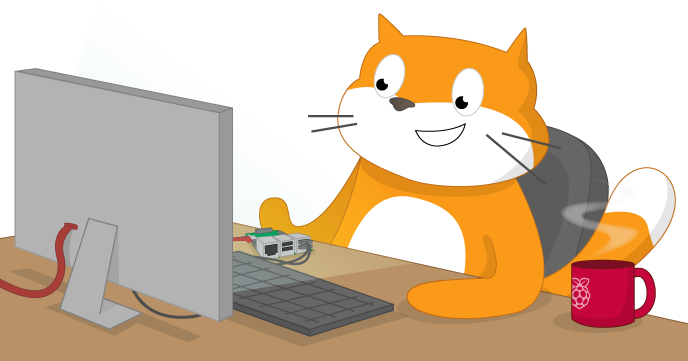

# Using Scratch 2.0 on Raspberry Pi

In this resource you will find out how to use Scratch 2.0 on Raspberry Pi

## Requirements
You will need a Raspberry Pi, the usual peripherals, and an up-to-date SD card.

### Software

You can access Scratch 2.0 at [https://scratch.mit.edu/](https://scratch.mit.edu/)

## The worksheet
* Go to the [worksheet](worksheet.md)

## Licence

Unless otherwise specified, everything in this repository is covered by the following licence:

***Using Scratch 2.0 on Raspberry Pi*** by the [Raspberry Pi Foundation](http://www.raspberrypi.org) is licenced under a [Creative Commons Attribution 4.0 International License](http://creativecommons.org/licenses/by-sa/4.0/).

Based on a work at https://github.com/raspberrypilearning/using-scratch2
