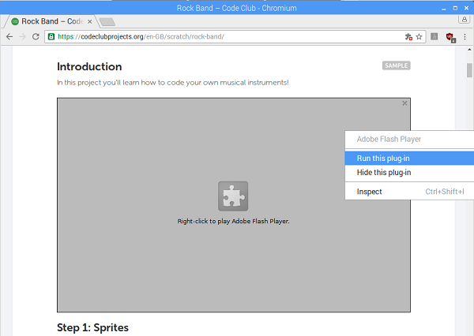
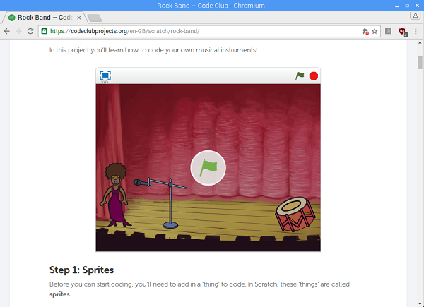

## Running the Flash plug-in

When you load up the page and scroll down to the example project, you will see a grey square appear where the project should be. This is because the Flash plug-in needs your permission to run.

- Right click on the grey square and select "Run this plug-in".

	

2. The plug in should start and the Scratch project should be displayed.

	

