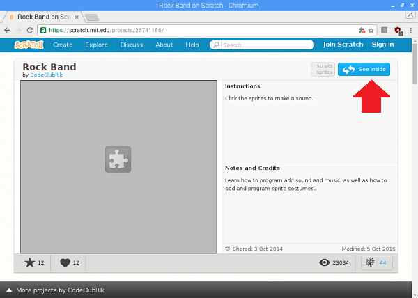
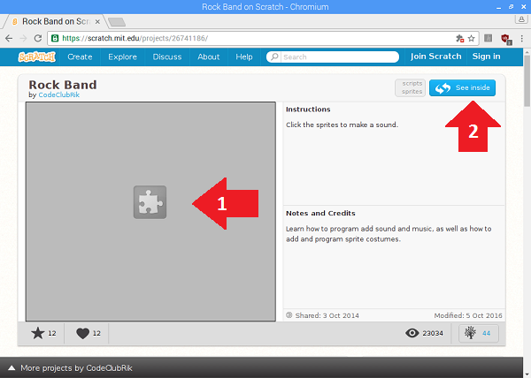

## Looking inside a project

If you visit the project page of an existing Scratch project on `http://scratch.mit.edu` and immediately try to click on the "See inside" button, **nothing will happen**. 

For example, this is the [Rock Band project page](https://scratch.mit.edu/projects/26741186/).

Follow these steps to be able to see the code for the project:

- Right click on the grey box and select "Allow this plug-in to run".
2. Then click on the "See inside" button.

	

