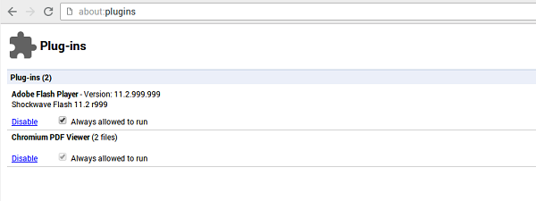

## Allowing Flash to run automatically

**CAUTION**: This setting is not enabled by default for security reasons because it will allow **all** Flash content to run automatically, not just Scratch projects. 

If you want to allow Flash plug-ins to always run automatically, you can follow these instructions:

- In a Chromium browser window, type `about:plugins` into the address bar, then press enter.
2. Find Adobe Flash Player and tick the box "Always allowed to run".

	
	
3. Close all Chromium windows and then reopen Chromium.

