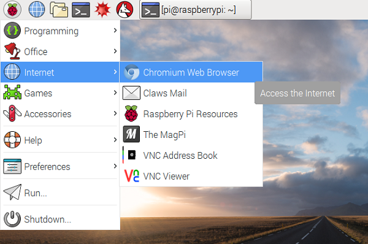
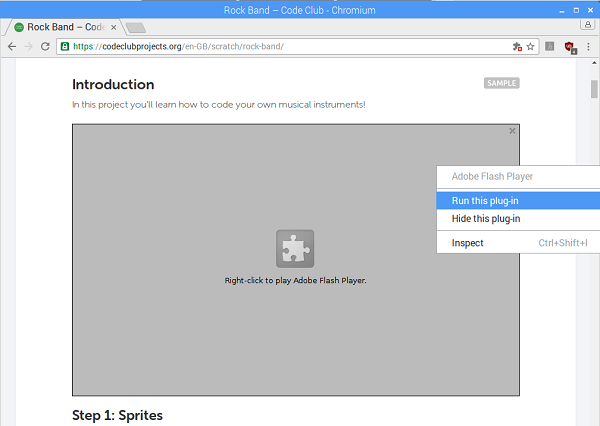
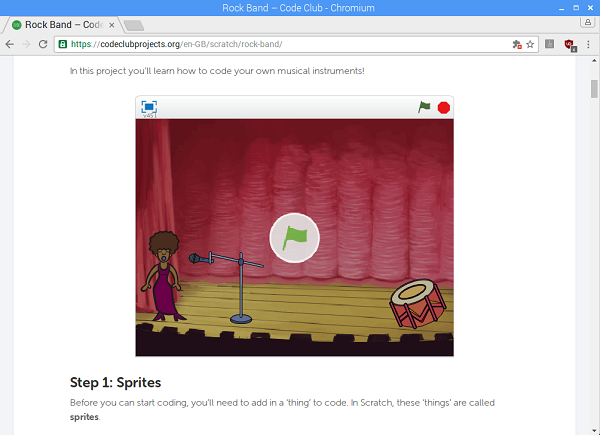
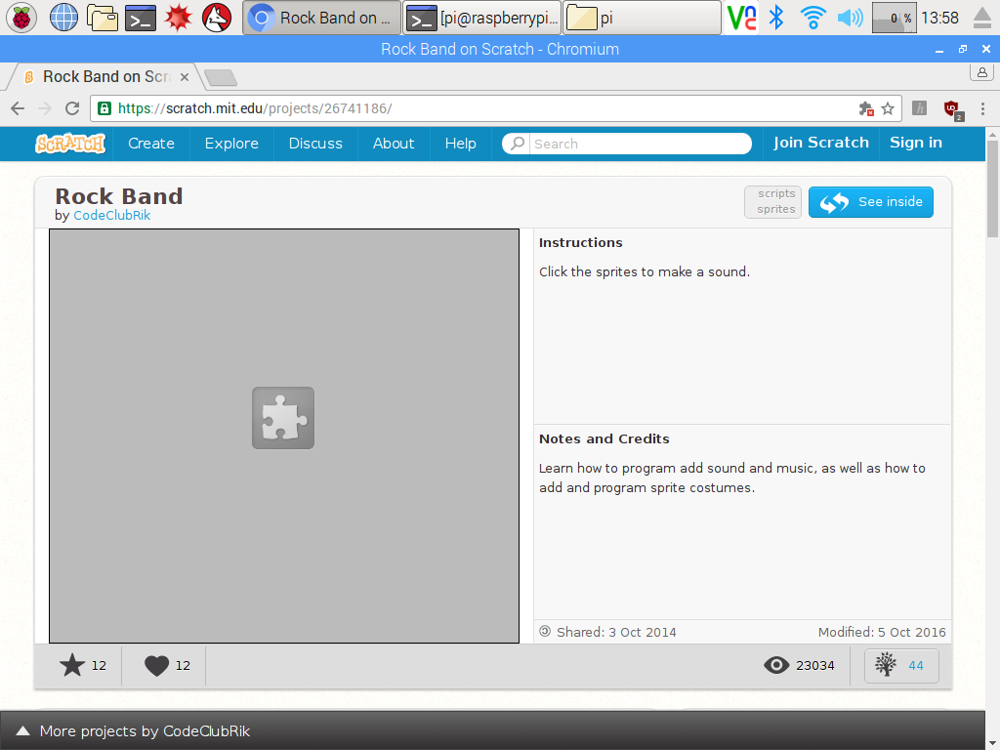
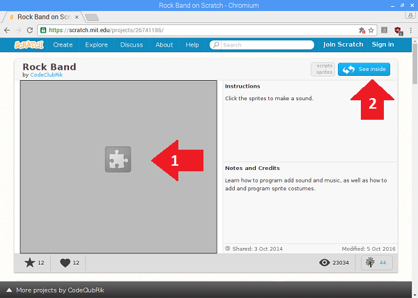

# Using Scratch 2.0 on Raspberry Pi

In this resource you will find out how to use Scratch 2.0 on Raspberry Pi.

## Updating your software

You will need an up-to-date version of NOOBS to be able to use Scratch 2.0. This is because Scratch 2.0 requires a browser software plug-in from the latest release of NOOBS to allow Flash content to run.

### Using a blank SD card

Follow this guide to [get started with a blank SD card](https://www.raspberrypi.org/learning/software-guide/quickstart/).

### Updating an existing installation
You can follow this guide to [update an existing SD card](https://www.raspberrypi.org/learning/software-guide/update-sd-card/) to the newest build.

After updating your SD card to the latest build, you should also install the Chromium mods which will enable the Flash player software. Then reboot your Raspberry Pi to allow the changes to take effect. Open a terminal window and type in the following commands:

```
sudo apt-get install -y rpi-chromium-mods
sudo reboot
```

## Opening Scratch
1. Open the Chromium web browser from the Internet menu.

	

2. Type in the address of the Scratch page you wish to visit. For the purposes of this resource, we will use the Code Club [Rock Band project](https://www.codeclubprojects.org/en-GB/scratch/) as an example.

## Running the Flash plug-in

When you load up the page and scroll down to the example project, you will see a grey square appear where the project should be. This is because the Flash plug-in needs your permission to run.

1. Right click on the grey square and select "Run this plug-in".

	

2. The plug in should start and the Scratch project should be displayed.

	

## Looking inside a project

If you visit the project page of an existing Scratch project on `http://scratch.mit.edu` and immediately try to click on the "See inside" button, **nothing will happen**. 

For example, this is the [Rock Band project page](https://scratch.mit.edu/projects/26741186/).



Follow these steps to be able to see the code for the project:

1. Right click on the grey box and select "Allow this plug-in to run".
2. Then click on the "See inside" button.

	

## Allowing Flash to run automatically

**CAUTION**: This setting is not enabled by default for security reasons because it will allow **all** Flash content to run automatically, not just Scratch projects. 

If you want to allow Flash plug-ins to always run automatically, you can follow these instructions:

1. In a Chromium browser window, type `about:plugins` into the address bar, then press enter.
2. Find Adobe Flash Player and tick the box "Always allowed to run".

	
	
3. Close all Chromium windows and then reopen Chromium.


## Sounds in Scratch 2.0 on Raspberry Pi

When using a sound block in a Scratch project for the first time, you may find there is a sound lag. If the sound is longer than a second then you may not hear the first second of the sound. For sounds shorter than one second, the sound may not play at all the first time the block is used. 

If you encounter this lag, running the script or clicking the sound block for a second time should result in the sound playing correctly.


## What next?
* [Simulate gravity](https://www.raspberrypi.org/learning/gravity-simulator/) with Scratch.
* Why not [code your own Rock Band](https://www.codeclubprojects.org/en-GB/scratch/rock-band/)?
* Perhaps you might [make a space animation](https://www.codeclubprojects.org/en-GB/scratch/lost-in-space/)? 
* You could even find out about starting a [Code Club](https://www.codeclub.org.uk/) at your school for more fun with Scratch.
